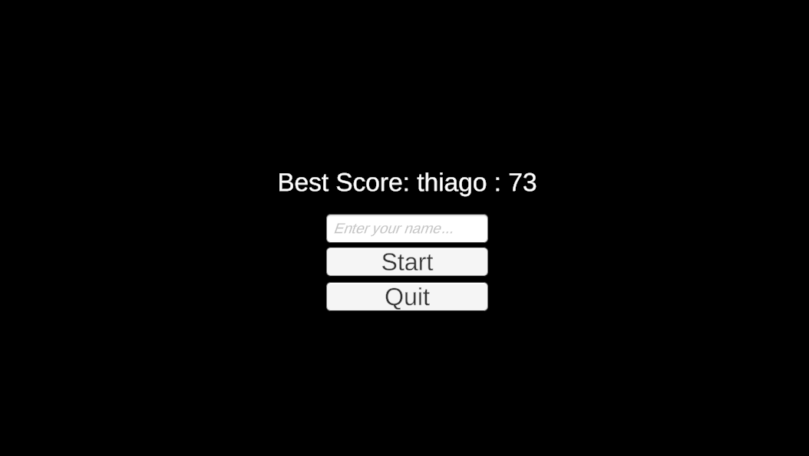

# Breakout Clone

This is a clone of the classic Breakout game developed using the Unity engine.

## How to Play

The goal of the game is to destroy all the bricks using the ball. The player controls a platform that can be moved from left to right to bounce the ball and prevent it from falling off the screen.

## Play Online

You can play the game online by clicking [here](https://play.unity.com/mg/other/breakout-clone-2).

## Screenshots

.png)
.png)
.png)
.png)

## Prerequisites

- Unity Editor version 2022.3.11f1 or higher

## How to Install

1. Clone this repository to your local machine using `git clone https://github.com/thiago-souzaf/Breakout-Clone.git`
2. Open the Unity project.
3. Navigate to the main scene located at `Assets/Scenes/MainScene.unity`.
4. Press the play button in the Unity Editor to start the game.

## Controls

- A/D or Left/Right arrow keys: Move the platform to the left or right, respectively.

